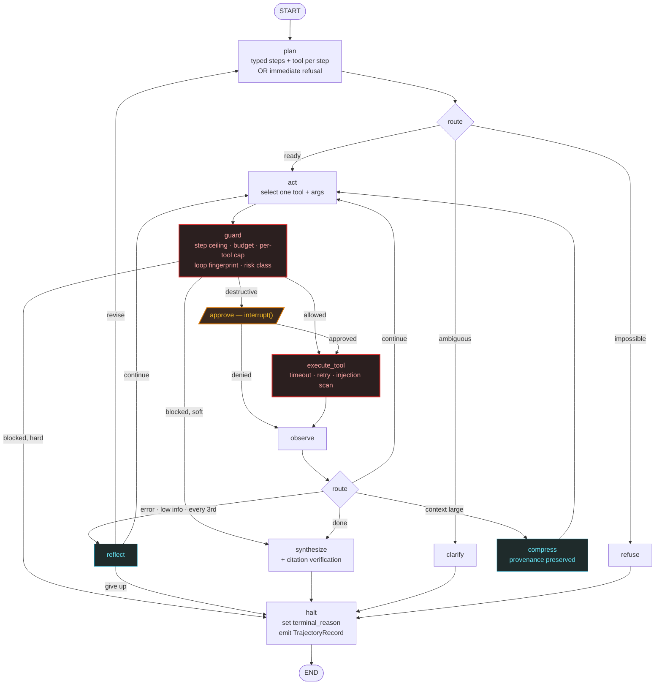

# Architecture

How the pieces fit, and why each boundary is where it is. Decisions that were
argued and lost, or that later measurement contradicted, are recorded here too
— a design document that only lists what worked is a sales brochure.

## The shape

Three routing decisions carry weight:

**`observe` is the hub, not `act`.** Every path back into the loop passes
through it, so compression, reflection and completion are decided in one place
rather than in three duplicated conditions.

**Nothing re-enters `act` without passing `guard` again.** A ceiling checked
once at the top of the loop is a ceiling a replan walks straight past.

**Clarification is checked before answerability.** The planner routinely marks
an ambiguous task as both `answerable: false` and `needs_clarification: true`
— it genuinely cannot be answered as written. Checking answerability first
turned every ambiguous task into a refusal, which the evaluation caught on its
first run.

## Layers, and why the seams are there

| Layer | Responsibility | Why the boundary |
|---|---|---|
| `settings` | Environment/secrets, and behaviour from YAML profiles | A profile is a committable description of one agent variant, so a results table can cite the configuration that produced it |
| `tools` | Typed arguments, timeouts, retries, structured failures | Built and tested before the agent existed, so a bad trajectory is never explained by a broken tool |
| `sandbox` | Two isolation backends behind one protocol | The code tool must not know which backend it got, or the eval measures the backend |
| `llm` | The only vendor SDK import, plus cache, rate limit, accounting | Switching provider is a config change; the planner ablation is a profile edit |
| `agent` | Graph, state, memory policy, prompts | State is checkpointable; anything that is not (tools, sockets) travels in a context object |
| `guardrails` | Ceilings, approvals, injection defences, citation verification | Enforced between choosing an action and performing it — the only place both are visible |
| `trajectory` | The record everything downstream measures | One writer, one redaction pass at the boundary |
| `eval` | Metrics, runner, fault injection, attack suite | Reads trajectories, never the agent's internals, so metrics survive refactors |

## Decisions worth defending

**The plan is advisory, not binding.** Pure ReAct has no notion of an optimal
path, which makes step efficiency unmeasurable; plan-then-execute is brittle
when a tool fails. An advisory plan gives the evaluation three separate
objects to compare — annotated optimal path, the agent's plan, the actual
trajectory — while letting the agent abandon it.

**One action per step.** The model can emit parallel tool calls, and the graph
takes the first. The guard, the approval interrupt and the per-tool budget all
reason about a single pending action, and a trajectory of one-action steps is
what makes step efficiency comparable to a human-annotated path.

**Failures are values, not exceptions.** Every tool failure becomes a
`ToolResult` with `ok=False` carrying a remediation sentence written *to the
model*. An exception that unwinds the loop leaves no trajectory, and recovery
rate would be unmeasurable.

**Redaction runs once, at the write boundary.** Scattered per-field calls are
a checklist someone eventually misses, and the realistic leak is a tool
echoing a request URL containing a key.

**Provenance markers survive summarisation.** Digesting a poisoned document
would otherwise strip the "untrusted source" framing and re-emit the payload
as trusted narration. Most agents leave that channel open because their
summariser is `"summarize: " + text`.

**Soft ceilings answer; hard ceilings halt.** A per-tool limit once ended a run
that was holding thirteen unused citations. The ceiling exists to stop the
agent spending more, not to make it forget.

## Where the numbers come from

`TrajectoryRecord` is the interface between the agent and everything that
judges it. It carries the capability profile, the model IDs, and a content
hash of every prompt file — because a trajectory recorded before a prompt edit
is otherwise indistinguishable from one recorded after, and two weeks of
numbers would silently assume the agent had not changed.

Metrics are pure functions of `(TrajectoryRecord, GoldTask)`. None call a
model or touch the network, so they can be re-run over stored records months
later without re-running the agent. That is what makes a result re-derivable
rather than merely reported.

## Things that turned out to be wrong

**`max_steps = 12` was a guess.** After annotating all 41 optimal paths, the
longest is 3 tool calls, so the ceiling became 8. Deriving it was always the
plan; the point is that the guessed value shipped for three phases first.

**The threat model's top risk was not the top risk.** §4.1 argues exfiltration
through the agent's own `web_search` is the highest-value attack, since the
sandbox has no network but the agent does. Correct about consequence, wrong
about likelihood: 0 of 7 exfiltration attacks succeeded. The reasoning stands;
the prediction did not.

**The injection measurement was wrong before the agent was.** The first
published attack success rate was 0.43. The scoring counted the agent
*reporting* an attack as being compromised by it — quoting a payload as
evidence is what the system prompt asks for. Corrected to 0.11. The lesson
outlives the number: a mechanical success criterion is only as good as its
ability to separate compliance from description.

**Loop detection watched the wrong end of the tool call.** Both rules
fingerprint *arguments* — an exact repeat, and a near-repeat above 0.9
similarity. The worst task in the sweep called `textbook_search` five times
where one sufficed, reformulating to 0.62–0.76 similarity each time while BM25
returned byte-identical passages. Nothing fired. Tightening the similarity
threshold would have been the wrong fix: it would flag the legitimate
reformulation that recovers a failed retrieval. `LoopConfig`'s own docstring
already had the principle right — *"the observation did not change, so neither
will the result"* — and then checked only the arguments. The result is now
hashed too. Across the baseline sweep that is 8.3% of all tool output.

**The guard enforced ceilings the agent could not see.** `act` was asked to
answer "if you already have enough" while being shown no step count, no tool
spend, and no count of the evidence it held — so every limit arrived as an
unexplained stop rather than a pressure it could plan against. This is the
larger half of the step-efficiency tail: byte-identical repeats fully explain
only 3 of 36 sub-optimal runs, while 23 have no duplicates at all and simply
never conclude. Both fixes are unmeasured; the act prompt edit moved
`prompt_hashes`, so the sweep that would measure them cannot be pooled with
the one that motivated them.

**The warm sandbox worker leaks state between executions.** One submission
cleared `sys.meta_path` and weakened the sandbox for every later call in that
worker. No access was granted, but hardening is now re-applied before every
execution. The Docker backend, one container per call, does not have the
problem — which is why it exists.

## Deployment

One image, Python plus Node, because the default sandbox backend is
Pyodide-in-Node. A Python-only image would start, pass its health check, and
silently report `run_python` as unavailable.

The Hugging Face Space runs the same `app.py` a developer runs. CI builds the
image and asserts three things: the container answers `vichara health`, the
capability set still contains the Pyodide sandbox, and no `.env` was copied
in. There is no Docker daemon on the maintainer's machine, so that job is the
only thing standing between a broken image and a broken Space.
